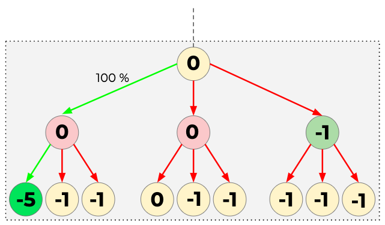
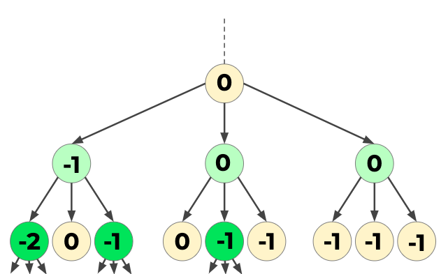
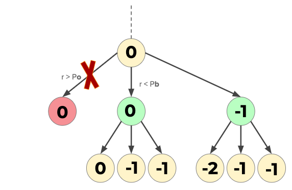

# Programmeer Theorie - Legend of Cysteine

UvA minor programmeren 2019 - ProgrammeerTheorie / Heuristiek
periode 5

### Auteurs

- Ruby Bron       12474223

- Sophie Stiekema 10992499

- Michael Stroet  11293284

## Aan de slag

### Vereisten
Deze codebase is volledig geschreven in Python3.6.3 In requirements.txt staan alle benodigde packages om de code succesvol te draaien. Deze zijn gemakkelijk te installeren via pip dmv. de volgende instructie:

pip install -r requirements.txt

(I HAVE COPIED THIS FROM EXAMPLE WEBSITE )

### Structuur
Alle Python scripts staan in de folder Code. In de map Data zitten alle input waardes en in de map Results worden alle resultaten opgeslagen door de code.

### Test
Om de code te draaien gebruik de instructie:

python3 main.py

Dan kan de gebruiker de volgende keuze maken:
- Resultaten opslaan of niet
- Resulaten printen of niet
- Een dimensie
- Een algoritme
- Een eiwit
- Een matrix grootte
Per algoritme kunnen er nog meer keuzes gemaakt worden:
- De hoeveelheid iteraties (voor Random Walk, Greedy en Greedy Look-ahead)
- De Beam width (voor Beam Search)
- De kansen voor het prunen van eiwitten met een energie onder het minimum (Branch and Bound)

## Meer uitleg over eiwitten, algoritmen, requirements.txt, bounds, etc.

## Protein Pow(d)er
Eiwitten zijn strengen van aminozuren. Deze kunnen op allerlei manieren gevouwen zijn. Als een eiwit in het lichaam niet goed gevouwen is kan dit tot ziektes leiden zoals kanker, Diabetes, Parkinsons en Alzheimer. Door de optimale vouwing van een eiwit te bepalen kunnen wetenschappers efficientere medicijnen creëren.  

In dit experiment proberen wij een eiwit zo stabiel mogelijk te vouwen. Dit gebeurt als de hydrofobe of Cysteine aminozuren tegen over elkaar geplaatst zijn. Twee Cysteine eiwitten verlagen de energie met - 5, een Cysteine en een hydrofobe of twee hydrofoben aminozuuren verlagen de energie met -1. Polaire aminozuren hebben geen invloed op de stabiliteit.

## Algoritmes

### Random Walk
### Greedy
### Greedy Lookahead

### Beam Search
Beam Search is een algoritme dat per lengte alle mogelijke opties sorteert en doorgaat met de paar beste. Bij aanvang van het programma kiest de gebruiker de "Beam Width", dit is hoeveel verschillende eiwitten bijgehouden worden. Beam Search garandeert alleen de beste oplossing als de Beam width op oneindig gezet wordt. Dan gedraagt hij zich al een breadth-first algoritme en gaat zo de hele toestandsruimte af. Bij elke nieuwe lengte kijkt het algoitme naar de energie van elk eiwit die tot nu toe gevouwen is, dan plaatst hij de volgende aminozuur alleen bij die eiwitten en ordert dan weer alle mogelijke locaties van de volgende aminozuur bij deze eiwitten, dan maakt hij weer een selectie van de beste enzovoort.
Het programma runt net zo lang tot er geen aminozuren meer zijn om te plaatsen. Dan retourneert hij de proteine met de laagste energie, die bovenaan de lijst staat.

### Probability Based Branch and Bound
Branch and Bound is een paradigma dat gebaseerd is op het depth-first algorithme. Het is recursief en non-stack. Onze versie van Branch and Bound is "probability-based", omdat wij met een element van kans werken kunnen wij niet de beste oplossing garanderen. Deze methode zou wel sneller moeten zijn omdat er vaker gepruned wordt.
Als een aminozuur niet polair is wordt er gekeken naar de mogelijke volgende plaasting van het aminozuur, in 2D zijn er maximaal 3 mogelijke locaties, in 3D zijn er maximaal 5 mogelijke locaties. Het aminozuur wordt geplaatst en dan wordt de energie van het (partiele) eiwit berekend. Als deze lager is dan de minimale enrgie tot nu toe wordt de proteine opgeslagen. Dan wordt deze energie toegevoegd aan een dictionary zodat wij telkens de gemiddelde energie tot nu toe kunnen berekenen. Nu zijn er 3 opties:
1. De energie van deze proteine is lager is dan de minimale energie die tot nu toe gevonden is. Nu blijkt deze vouwing zeer belovend te zijn, en gaat het programma de volgende aminozuur plaatsen.
2. De energie van deze proteine is hoger dan de minimale energie maar alsnog lager dan de gemiddelde energie van de proteine die tot nu toe geplaatst is. Nu geeft het programma het aminozuur een kans om door te gaan. Een willekeurig cijfer tussen 0 en 1 wordt gegenereed en dit wordt vergeleken met de van te voren ingestelde kansen vor het prunen. Als het willekeurige getal lager of gelijk is aan deze kans  gaat het programma verder met plaatsen. Als het willekeurige getal groter is dan de kans, dan wordt dit aminozuur 'gepruned', het programma gaat dan een stap terug, naar de ouder en plaatst het volgende kind aminozuur.
3. De energie van deze proteine is hoger dan de gemiddelde energie van de proteine die tot nu toe geplaatst is. Nu geeft het programma het aminozuur ook een kans om door te gaan. Een willekeurig cijfer tussen 0 en 1 wordt gegenereed en dit wordt vergeleken met de van te voren ingestelde kansen vor het prunen. De kans zou wel kleiner moeten zijn dan bij de tweede optie omdat deze vouwing minder belovend is. Als het willekeurige getal lager of gelijk is aan deze kans  gaat het programma verder met plaatsen. Als het willekeurige getal groter is dan de kans, dan wordt dit aminozuur 'gepruned', het programma gaat dan een stap terug, naar de ouder en plaatst het volgende kind aminozuur.
Het programma runt net zo lang tot er geen aminozuren meer zijn om te plaatsen. Dan retourneert hij de opgeslagen proteine met de laagste energie.

### Hill Climber

##Dankwoord

## References

Engstler, J., & Giovambattista, N. (2018). Comparative Study of the Effects of Temperature and Pressure on the Water-Mediated Interactions between Apolar Nanoscale Solutes. The Journal of Physical Chemistry B, 123(5), 1116-1128.

Chen, M. & Huang, W. (2005). A Branch and Bound Algorithm for the Protein Folding Problem in the HP Lattice Model. Genomics, Proteomics & Bioinformatics, 3(4), 225-230.

Selkoe, D. J. (2003). Folding proteins in fatal ways. Nature, 426(6968), 900.

Zhang, Jinfeng, Samuel C. Kou, and Jun S. Liu. (2007). Biopolymer structure simulation and optimization via fragment regrowth Monte Carlo. Journal of Chemical Physics 126(22): 225101.
