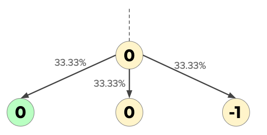
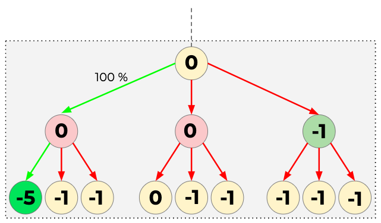
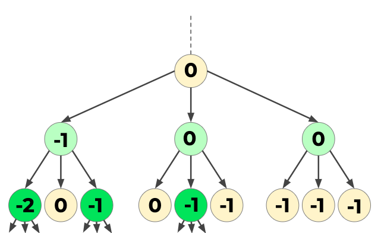
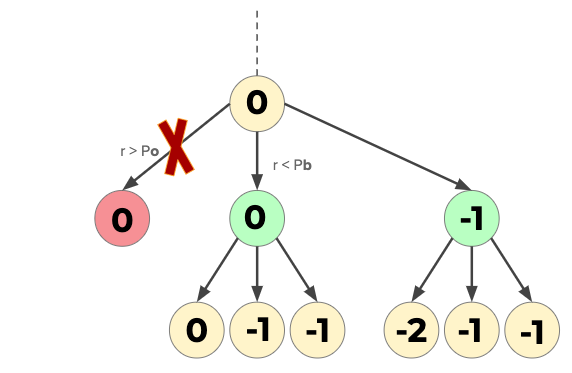

# Algoritmes

1. [Random Walk](#random-walk)
2. [Greedy (Look-ahead)](#greedy-look-ahead)
3. [Beam Search](#beam-search)
4. [Probability based Branch and Bound](#probability-based-branch-and-bound)
5. [Hill Climber](#hill-climber)

## **Random Walk**

Random Walk, ookwel Random Sampling genoemd, is het willekeurig creëren van oplossingen in de hoop dat een goede oplossing wordt gevonden. Bij het vouwen van eiwitten worden één voor één aminozuren op een willekeurig naastliggende locatie geplaatst. Voor elk geplaatste aminozuur wordt de energie bijdrage daarvan bepaald en opgeteld bij het totaal. Dit wordt herhaald totdat alle aminozuren zijn geplaatst of totdat geen locaties meer over zijn om een nieuw aminozuur te plaatsen (bijvoorbeeld midden in een spiraal).

De random walk wordt een aantal keer herhaald, bepaald door de gebruiker, en retourneert daarna de beste oplossing.

## **Greedy (Look-ahead)**

Greedy is een uitbreiding van de random walk. In plaats van willekeurig de volgende locatie te kiezen, wordt eerst naar de energieën gekeken. De klassieke greedy kijkt alleen naar zijn buren en plaatst het volgende aminozuur op de locatie met de laagste energie. Als meerdere locaties aanwezig zijn met dezelfde laagste energie, wordt de volgende locatie hieruit willekeurig gekozen.

Het is echter ook mogelijk om verder te kijken, door een aantal stapjes verder te kijken is het mogelijk om een betere oplossing te vinden. Een voorbeeld hiervan is in het onderstaande figuur. De greedy zonder 'look-ahead' vindt alleen maar -1 oplossingen, maar met een look-ahead van 1 kiest het algoritme voor de linker 0 energie omdat er verderop een -5 is gevonden.

Net zoals random worden deze stappen herhaald totdat alle aminozuren geplaatst zijn of totdat geen locaties meer over zijn om nieuwe aminozuren in te plaatsen.

De greedy search met look-ahead wordt een aantal keer herhaald, bepaald door de gebruiker, en retourneert daarna de beste oplossing.

## **Beam Search**

Beam Search is een algoritme dat per lengte alle mogelijke opties sorteerd en doorgaat met de paar beste. Bij aanvang van het programma kiest de gebruiker de "Beam Width", dit is hoeveel verschillende eiwitten bijgehouden worden. Beam Search garandeert alleen de beste oplossing als de Beam width op oneindig gezet wordt. Dan gedraagt hij zich als een breadth-first algoritme en gaat zo de hele toestandsruimte af. Bij elke nieuwe lengte kijkt het algoritme naar de energie van elk eiwit die tot nu toe gevouwen is, dan plaatst hij de volgende aminozuur alleen bij die eiwitten en ordent dan weer alle mogelijke locaties van de volgende aminozuur bij deze eiwitten, dan maakt hij weer een selectie van de beste enzovoort.

Het programma runt net zo lang tot er geen aminozuren meer zijn om te plaatsen. Dan retourneert hij de proteïne met de laagste energie, die bovenaan de lijst staat.

## **Probability based Branch and Bound**

Branch and Bound is een paradigma dat gebaseerd is op het depth-first algoritme. Het is recursief en non-stack. Deze versie van Branch and Bound is "probability-based", omdat er met een element van kans wordt gewerkt, kan de beste oplossing niet gegarandeerd worden. Deze methode zou echter wel sneller moeten zijn omdat er vaker gepruned wordt.

Als een aminozuur niet polair is wordt gekeken naar de mogelijke volgende plaasting van het aminozuur, in 2D zijn maximaal 3 mogelijke locaties, in 3D zijn maximaal 5 mogelijke locaties. Het aminozuur wordt geplaatst en dan wordt de energie van het (partiele) eiwit berekend. Als deze lager is dan de minimale energie tot nu toe wordt de proteine opgeslagen. Dan wordt deze energie toegevoegd aan een dictionary, waarna de gemiddelde energie tot nu toe wordt berekend. Nu zijn er 3 opties:

1. De energie van deze proteine is lager dan de minimale energie die tot nu toe gevonden is. Nu blijkt deze vouwing zeer belovend te zijn, en gaat het programma de volgende aminozuur plaatsen.
2. De energie van deze proteine is hoger dan de minimale energie maar alsnog lager dan de gemiddelde energie van de proteine die tot nu toe geplaatst is. Nu geeft het programma het aminozuur een kans om door te gaan. Een willekeurig cijfer tussen 0.0 en 1.0 wordt gegenereed en dit wordt vergeleken met de van te voren ingestelde kansen voor het prunen. Als het willekeurige getal lager of gelijk is aan deze kans, gaat het programma verder met plaatsen. Als het willekeurige getal groter is dan de kans, dan wordt dit aminozuur 'gepruned', het programma gaat dan een stap terug, naar de ouder en plaatst het volgende kind aminozuur.
3. De energie van deze proteïne is hoger dan de gemiddelde energie van de proteïne die tot nu toe geplaatst is. Nu geeft het programma het aminozuur ook een kans om door te gaan. Een willekeurig cijfer tussen 0.0 en 1.0 wordt gegenereed en dit wordt vergeleken met de van te voren ingestelde kansen voor het prunen. De kans zou wel kleiner moeten zijn dan bij de tweede optie omdat deze vouwing minder belovend is. Als het willekeurige getal lager of gelijk is aan deze kans  gaat het programma verder met plaatsen. Als het willekeurige getal groter is dan de kans, dan wordt dit aminozuur 'gepruned', het programma gaat dan een stap terug, naar de ouder en plaatst het volgende kind aminozuur.

Het programma runt net zo lang tot geen aminozuren meer over zijn om te plaatsen. Dan retourneert hij de opgeslagen proteïne met de laagste energie.

## **Hill Climber**

Hill climber ofwel de local search, is een algoritme dat kleine aanpassingen maakt aan een al bestaande oplossing om zo tot een betere oplossing te komen. Wanneer deze aanpassingen een verbetering voortbrengen, wordt de verbetering doorgevoerd. Daarna probeert het algorimte in deze verbeterde staat te zoeken naar een nog betere oplossing. Verslechteringen worden nooit toegelaten. In het geval van deze implementatie laat het wel gelijke toestanden toe. Het algoritme is in dit geval depth first, recursief en non-stack. 

Het algoritme start met eiwit dat greedy gevouwen is, waardoor het eiwit vaak al met een lagere energie toestand begint dan bijvoorbeeld met een random gevouwen eiwit. De hillclimber heeft drie globale stappen. Voor deze stappen vult de gebruiker eerst in hoeveel aminozuren moeten worden weggeknipt tussen twee punten en hoevaak het eiwit wordt geknipt en hervouwen. Dan wordt het daadwerkelijke algoritme in werking gesteld:

1. Eerst worden de aminozuren verwijderd op een random locatie op het eiwit.
2. Daarna worden op deze leegte de verwijderde aminozuren recursief depth-first teruggeplaatst. Eerst wordt vastgesteld wat de mogelijke locaties zijn, hierna wordt de volgorde geschud en op de eerste richting de eerste aminozuur geplaatst. Hiervan worden dan opnieuw de mogelijke locaties vastgesteld, geschud en geplaatst. Dit gebeurt totdat het niet meer mogelijk is om een plaats te vinden of tot alle aminozuren zijn teruggeplaats. Wanneer geen nieuwe locatie mogelijk is, wordt de laatst geplaatste aminozuur verwijderd en een volgende locatie geprobeerd. Wanneer alle aminozuren zijn teruggeplaatst geeft de recursieve functie de afgemaakte functie terug.
3. De mogelijk nieuwe oplossing wordt vergeleken met de oude oplossing op energie gebied. Wanneer de nieuwe oplossing een gelijke of lagere toestand heeft gevonden wordt deze oplossing de "oude" oplossing. Zo niet, dan blijft de "oude" oplossing bestaan voor de volgende knip en vouw stap. 

Het programma runt net zo lang tot de hoeveelheid knip en vouw stappen zijn bereikt die de gebruiker heeft ingevoerd.

